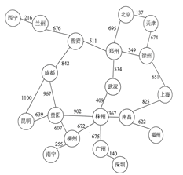

1. 文章编辑（限1 人完成）  
　　功能：输入一页文字，程序可以统计出文字、数字、空格的个数。  
　　静态存储一页文章，每行最多不超过80个字符，共N行；  
   - 要求  
      1. 分别统计出其中英文字母数和空格数及整篇文章总字数；  
      2. 统计某一字符串在文章中出现的次数，并输出该次数；  
      3. 删除某一子串，并将后面的字符前移。存储结构使用线性表，分别用几个子函数实现相应的功能，输入数据的形式和范围：可以输入大写、小写的英文字母、任何数字及标点符号。  
   - 输出形式：  
      1. 分行输出用户输入的各行字符；  
      2. 分4行输出"全部字母数"、"数字个数"、"空格个数"、"文章总字数"   
      3. 输出删除某一字符串后的文章；
2. 利用栈求表达式的值（限1 人完成）
   - 任务：建立试题库文件，随机产生n个题目；题目涉及加减乘除，带括号的整数混合运算；随时可以退出；保留历史分数，能回顾历史，给出与历史分数比较后的评价。（假设这是一个可供小学生练习算术运算的小系统）
   - 要求：根据以上任务说明，设计程序完成功能。
3. 教学计划编制问题（限1 人完成） 
   - 设计要求：针对计算机系本科课程，根据课程之间的依赖关系（如离散数学应在数据结构之前开设）制定课程安排计划，并满足各学期课程数目大致相同。
4. 哈夫曼编码/译码器（限1 人完成）   
    - 设计一个利用哈夫曼算法的编码和译码系统，重复地显示并处理以下项目，直到选择退出为止。
        1.	将权值数据存放在数据文件(文件名为data.txt，位于执行程序的当前目录中) 
        2.	分别采用动态和静态存储结构
        3.	初始化：键盘输入字符集大小n、n个字符和n个权值，建立哈夫曼树；
        4.	编码：利用建好的哈夫曼树生成哈夫曼编码；
        5.	输出编码；
        6.	设字符集及频度如下表：
        字符 空格 A B C D E F G H I J K L M
        频度 186 64 13 22 32 103 21 15 47 57 1 5 32 20
        字符 N O P Q R S T U V W X Y Z 
        频度 57 63 15 1 48 51 80 23 8 18 1 16 1 
    - 进一步完成内容】
        1.	译码功能；
        2.	显示哈夫曼树；
        3.	界面设计的优化。
5. 排序综合（限1 人完成）
   - 利用随机函数产生N个随机整数（20000以上），对这些数进行多种方法进行排序。
要求：
     1. 至少采用三种方法实现上述问题求解（提示，可采用的方法有插入排序、希尔排序、起泡排序、快速排序、选择排序、堆排序、归并排序）。并把排序后的结果保存在不同的文件中。
     2. 统计每一种排序方法的性能（以上机运行程序所花费的时间为准进行对比），找出其中两种较快的方法。
     3. 如果采用4种或4种以上的方法者，可适当加分。

6. 模拟导航（限2 人完成）
   - 根据北斗高精度定位技术绘制出了全国部分高速公路地图，全国部分主体骨干网络如下图所示。其中圆圈中是城市名，连线及连线上的数分别代表两个城市之间的公路及路程模拟数值。    
       
   图 2 全国部分高速公路主体骨干网络  
   - 智能驾驶需要计算从源点到终点的最短路径长度，并显示出具体路径。根据上图所示信息，输入源点和终点，编程实现模拟智能驾驶。  
   - 【实践要求】  
   为了使算法具有普适性，要求输入的源点和终点由用户自主设定。  
       1. 输入要求：输入的内容为路径的源点和终点，用空格隔开；  
       2. 输出要求：输出的内容有2行，第1行是从源点到终点的最短路径，以箭头指向途径城市，第2行显示最短路径长度。  
       例如：输入： 北京 上海  
       输出：最短路径是北京->天津->徐州->上海  
       最短路径长度是1462km  
